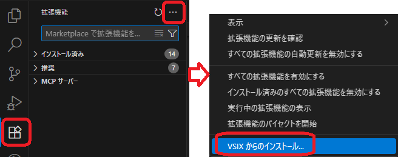

# Cat5Dev

Cat5Dev is a VSCode extension that syncs VBA modules between VSCode and CATIA V5.

---

## Features

### Pull / Push VBA Modules
Sync VBA modules between CATIA V5 and your local workspace.

- **Pull** — Export all VBA modules from the target CATIA project to the local `modules/` folder
- **Push** — Import local VBA modules back into CATIA (only changed files are transferred, unchanged modules are skipped for speed)

### Target Project Selection
Select the CATIA VBA project to sync with via a quick-pick dialog.
The selected project name is saved in `cat5dev.toml` under the `[project]` section and persists across sessions.

### Module Tree View
A dedicated panel in the Activity Bar shows the current state of your workspace.

- Displays the target project name
- Modules are grouped by type:
  - **Standard Modules** (`.bas_utf`)
  - **Class Modules** (`.cls_utf`)
  - **UserForms** (`.frm_utf`)
- Click any module to open it in the editor
- The tree updates automatically when the target project is changed
- Right-click any module to access context menu options:
  - **Rename** — Rename the module file
  - **Delete** — Delete the module file (with confirmation)
  - **Copy Path** — Copy the full file path to clipboard

### Toolbar Buttons
Quick-access buttons are available in the panel title bar:

| Icon | Action |
|------|--------|
| ☁️↓ | Pull from CATIA |
| ☁️↑ | Push to CATIA |
| ⚙️ | Select target project |
| 🔄 | Refresh module list |
| 🌐 | Switch language |

### Multi-Language Support
The extension supports both **Japanese (日本語)** and **English**.
- Click the 🌐 button in the panel title bar to switch languages
- The language preference is saved in `cat5dev.toml` under the `[project]` section
- All UI messages, TreeView labels, and tooltips will be translated
- A reload of VSCode is required to apply the new language setting

### Symbol Navigation
VBA symbols are recognized and exposed to VSCode's navigation features:

- **Breadcrumb** — Shows the current `Sub` / `Function` / `Property` name as you move the cursor
- **Outline view** — Lists all procedures and properties in the current file
- **Go to Symbol** (`Ctrl+Shift+O`) — Jump directly to any procedure

Recognized symbol types: `Sub`, `Function`, `Property Get/Let/Set`, `Type`, `Enum`

### VBA Linter

A built-in VBA linter runs in real time as you edit `.bas_utf`, `.cls_utf`, and `.frm_utf` files.
Diagnostics are displayed inline as squiggly underlines and shown in the **Problems** panel.

**Rules:**

| Code | Rule | Severity |
|------|------|----------|
| VBA001 | `Option Explicit` not declared | Warning |
| VBA002 | `On Error Resume Next` usage | Warning |
| VBA003 | `GoTo` usage (excluding `On Error GoTo`) | Warning |
| VBA004 | Line exceeds maximum length (default: 100) | Warning |
| VBA005 | Variable declared with `Dim` but never used | Warning |
| VBA006 | Nesting depth exceeds threshold (default: 5) | Warning |
| VBA007 | Sub/Function exceeds line count threshold (default: 300) | Warning |
| VBA008 | Mismatched parentheses | Error |
| VBA009 | Missing `End If` / `End Sub` / `End Function` etc. | Error |

**Configuration (`cat5dev.toml`):**

Linting is **disabled by default**. To enable it, create a `cat5dev.toml` file in your workspace root:

1. Run **`cat5dev.init`** from the Command Palette to generate a configuration template, or
2. Manually create `cat5dev.toml` with the following structure:

```toml
[project]
target_project = ""
language = "en"

[lint]
enabled = true

[lint.rules]
option_explicit       = true
on_error_resume_next  = false
goto                  = false
max_line_length       = 100   # 0 = disabled
unused_variables      = true
max_nesting_depth     = 5     # 0 = disabled
max_function_lines    = 300   # 0 = disabled
unmatched_parens      = true
unmatched_blocks      = true

[formatter]
enabled = false
# ... (see Formatter section below)
```

Changes to `cat5dev.toml` take effect immediately on save — no reload required.

### VBA Formatter (`Shift+Alt+F` / on save)

A built-in VBA code formatter is available on demand (`Shift+Alt+F`) or automatically on save.

The formatter is **disabled by default**. To enable it, set `enabled = true` in `cat5dev.toml`:

```toml
[formatter]
enabled = true
```

**Default formatting (when enabled):**
- Keyword capitalization (`dim` → `Dim`, `end if` → `End If`, etc.)
- Indentation correction (blocks: `Sub`, `If`, `For`, `With`, `Select Case`, etc.)
- Trailing whitespace removal
- Space before continuation marker (`Show(_` → `Show( _`)
- Continuation line indentation (`_` lines get +1 extra indent; closing-only lines like `)` are exempt)
- Blank line normalization (max 2 consecutive blank lines; blank line guaranteed between procedures)

**Optional formatting (disabled by default):**

| `cat5dev.toml` key | Description |
|---------------------|-------------|
| `normalize_operator_spacing` | `x=1+2` → `x = 1 + 2` |
| `normalize_comma_spacing` | `foo(a,b)` → `foo(a, b)` |
| `normalize_comment_space` | `'comment` → `' comment` |
| `expand_type_suffixes` | `Dim x%` → `Dim x As Integer` |

**Full `cat5dev.toml` formatter configuration:**

```toml
[formatter]
enabled = true
indent_size = 4
capitalize_keywords = true
fix_indentation = true
trim_trailing_space = true
ensure_continuation_space = true
indent_continuation_lines = true
max_blank_lines = 2
normalize_operator_spacing = false
normalize_comma_spacing = false
normalize_comment_space = false
expand_type_suffixes = false
format_on_save = false
```

---

## Requirements

- CATIA V5 must be running with a VBA project open
- Windows (uses COM automation via `cscript.exe`)

---

## Installation

Cat5Dev is distributed as a `.vsix` file. Install it as follows:

1. **Download the `.vsix` file**  
   Obtain `cat5dev-x.x.x.vsix` (or later) from the release page.

2. **Install in VSCode**  
   In VSCode, open the Extensions view (`Ctrl+Shift+X`), then click the `⋯` menu in the top-right corner and select **Install from VSIX...**

   

3. **Select the file**  
   Choose the downloaded `.vsix` file and confirm installation.

### ⚠️ Important: Backup CATIA Settings Before First Use

Before using Cat5Dev for the first time, **backup your CATIA V5 settings folder**:

- **Folder path**: `%APPDATA%\Dassault Systemes\CATSettings`
- **Why**: In rare cases, CATIA settings can become corrupted or misconfigured. Having a backup allows you to restore settings if needed.

**Backup procedure:**
```
1. Press Win+R and type: %APPDATA%
2. Navigate to Dassault Systemes\CATSettings
3. Right-click and select "Copy"
4. Paste it in a safe location (e.g., Desktop, OneDrive, etc.)
5. Rename the backup folder (e.g., "CATSettings_backup_2026-04-18")
```

---

## File Structure

```
<workspace>/
├── .gitignore                      # Generated by cat5dev.init
├── cat5dev.toml                    # Configuration file (generated by cat5dev.init)
└── modules/
    ├── MyModule.bas_utf            # Standard Module
    ├── MyClass.cls_utf             # Class Module
    └── MyForm.frm_utf              # UserForm
```

> Settings are stored in `cat5dev.toml` under the `[project]` section:
> - `target_project` — The name of the target CATIA VBA project
> - `language` — `"ja"` for Japanese, `"en"` for English (default: `"ja"`)

---

## Getting Started

1. Install the extension
2. Open a workspace folder in VSCode
3. Click the **Cat5Dev** icon in the Activity Bar
4. Click ⚙️ to select the target CATIA VBA project
5. Click ☁️↓ **Pull** to import modules from CATIA into the `modules/` folder
6. Edit your VBA code in VSCode
7. Click ☁️↑ **Push** to sync changes back to CATIA

---

## Important: Save in CATIA's VBA Editor after Push

After pushing from VSCode, **you must save the project in CATIA's VBA Editor** (Tools > Save, or `Ctrl+S` inside the VBA Editor).

Push writes the module code into CATIA's in-memory VBE. If CATIA is closed without saving, all pushed changes will be lost.

```
VSCode (edit) → Push → Save in CATIA's VBA Editor ✅
                         ↓
                       Changes are persisted in the CATIA document
```

---

## Notes

- VBA files are stored in UTF-8 encoding with a `_utf` suffix to distinguish them from CATIA's native Shift-JIS exports
- The extension targets CATIA V5's VBE (Visual Basic Editor) via COM (`MSAPC.Apc`)
- Debug execution within VSCode is not currently supported; use CATIA's own VBA IDE for debugging

---

## Why VBA?

I’ve experimented with CATIA V5 macro development in several languages, but there are a few reasons why I ultimately returned to VBA:

- **Native support** — VBA is built directly into CATIA V5
- **Best development environment** — The VBE is still the most complete and stable option
- **Surprisingly fast** — In many cases, VBA outperformed alternatives
- **Compact distribution** — No external runtimes or dependencies required

Do I *like* VBA as a language?  
Well… that’s a different question entirely.

---

## Notes on Encoding (Please Help)

I have only ever used the Japanese version of CATIA V5, so I am familiar only with files exported from the VBA Editor being saved in Shift‑JIS. Because this was quite inconvenient, Cat5Dev automatically converts the encoding to UTF‑8 during the Pull/Push process.

If you encounter garbled characters when using this extension in your environment, you may need to adjust the encoding settings. Unfortunately, I have no way to verify its behavior outside of a Japanese environment.

If you run into any issues, please feel free to let me know.

---

## License

MIT

---
---
Cat5Dev は、VSCode と CATIA V5 の間で VBA モジュールを同期する VSCode 拡張機能です。

---

## 機能

### VBA モジュールの Pull / Push
CATIA V5 とローカルワークスペース間で VBA モジュールを同期します。

- **Pull** — 対象 CATIA プロジェクトからすべての VBA モジュールをローカルの `modules/` フォルダにエクスポート
- **Push** — ローカルの VBA モジュールを CATIA にインポート（変更されたファイルのみ転送し、未変更のモジュールはスキップして高速化）

### 対象プロジェクトの選択
クイックピックダイアログから同期する CATIA VBA プロジェクトを選択できます。
選択したプロジェクト名は `cat5dev.toml` の `[project]` セクションに保存され、セッションをまたいで維持されます。

### モジュールツリービュー
アクティビティバーに専用パネルを表示し、ワークスペースの現在の状態を確認できます。

- 対象プロジェクト名を表示
- モジュールはタイプ別にグループ化：
  - **標準モジュール** (`.bas_utf`)
  - **クラスモジュール** (`.cls_utf`)
  - **ユーザーフォーム** (`.frm_utf`)
- モジュールをクリックするとエディタで開く
- 対象プロジェクトを変更するとツリーが自動更新
- モジュール上で右クリックするとコンテキストメニューが表示：
  - **名前変更** — モジュールファイルの名前を変更
  - **削除** — モジュールファイルを削除（確認あり）
  - **パスをコピー** — ファイルの完全パスをクリップボードにコピー

### ツールバーボタン
パネルタイトルバーにクイックアクセスボタンが表示されます：

| アイコン | 操作 |
|----------|------|
| ☁️↓ | CATIA から Pull |
| ☁️↑ | CATIA へ Push |
| ⚙️ | 対象プロジェクトを選択 |
| 🔄 | モジュール一覧を更新 |
| 🌐 | 言語を切り替え |

### 多言語対応
拡張機能は**日本語（日本語）**と**英語（English）**に対応しています。
- パネルタイトルバーの 🌐 ボタンをクリックして言語を切り替え
- 言語設定は `cat5dev.toml` の `[project]` セクションに保存されます
- すべての UI メッセージ、TreeView ラベル、ツールチップが翻訳されます
- 新しい言語設定を適用するには VSCode の再読み込みが必要です

### シンボルナビゲーション
VBA シンボルが認識され、VSCode のナビゲーション機能に公開されます：

- **ブレッドクラム** — カーソル位置の `Sub` / `Function` / `Property` 名を表示
- **アウトラインビュー** — 現在のファイルのすべてのプロシージャとプロパティを一覧表示
- **シンボルへ移動** (`Ctrl+Shift+O`) — 任意のプロシージャに直接ジャンプ

認識されるシンボルタイプ： `Sub`、`Function`、`Property Get/Let/Set`、`Type`、`Enum`

### VBA Lint

`.bas_utf`・`.cls_utf`・`.frm_utf` ファイルの編集中、リアルタイムで VBA Lint が実行されます。
診断結果はエディタ上の波線と **Problems** パネルに表示されます。

**ルール一覧：**

| コード | ルール | 重要度 |
|--------|--------|--------|
| VBA001 | `Option Explicit` が宣言されていない | 警告 |
| VBA002 | `On Error Resume Next` の使用 | 警告 |
| VBA003 | `GoTo` の使用（`On Error GoTo` は除外） | 警告 |
| VBA004 | 最大行長超過（デフォルト: 100文字） | 警告 |
| VBA005 | `Dim` 宣言後に一度も使用されない変数 | 警告 |
| VBA006 | ネスト深さが閾値を超過（デフォルト: 5） | 警告 |
| VBA007 | Sub/Function の行数が閾値を超過（デフォルト: 300行） | 警告 |
| VBA008 | 括弧の不一致 | エラー |
| VBA009 | `End If` / `End Sub` / `End Function` 等の End 忘れ | エラー |

**設定（`cat5dev.toml`）：**

Lint はデフォルトで無効です。有効にするには、ワークスペースルートに `cat5dev.toml` ファイルを作成します：

1. コマンドパレットから **`cat5dev.init`** を実行するか、
2. 以下の内容で `cat5dev.toml` を手動作成してください：

```toml
[project]
target_project = ""
language = "ja"

[lint]
enabled = true

[lint.rules]
option_explicit       = true
on_error_resume_next  = false
goto                  = false
max_line_length       = 100   # 0 = 無効
unused_variables      = true
max_nesting_depth     = 5     # 0 = 無効
max_function_lines    = 300   # 0 = 無効
unmatched_parens      = true
unmatched_blocks      = true

[formatter]
enabled = false
# ... （フォーマッタセクション参照）
```

`cat5dev.toml` の変更は保存後すぐに反映されます（再読み込み不要）。

### VBA フォーマッタ（`Shift+Alt+F` / 保存時）

`Shift+Alt+F` またはファイル保存時に VBA コードフォーマッタを実行できます。

フォーマッタは**デフォルトで無効**です。`cat5dev.toml` で `enabled = true` を設定して有効化します：

```toml
[formatter]
enabled = true
```

**有効時のデフォルト処理：**
- キーワード大文字化（`dim` → `Dim`、`end if` → `End If` など）
- インデント修正（`Sub`、`If`、`For`、`With`、`Select Case` などのブロック）
- 行末スペース除去
- 継続行マーカー前スペース追加（`Show(_` → `Show( _`）
- 継続行インデント（`_` で終わる行の次行は +1 インデント、ただし `)` のみの行は除外）
- 空行正規化（連続2行まで・プロシージャ間に空行1行を保証）

**オプション（デフォルト無効）：**

| `cat5dev.toml` キー | 説明 |
|----------------------|------|
| `normalize_operator_spacing` | `x=1+2` → `x = 1 + 2` |
| `normalize_comma_spacing` | `foo(a,b)` → `foo(a, b)` |
| `normalize_comment_space` | `'comment` → `' comment` |
| `expand_type_suffixes` | `Dim x%` → `Dim x As Integer` |

**`cat5dev.toml` フォーマッタ設定の全項目：**

```toml
[formatter]
enabled = true
indent_size = 4
capitalize_keywords = true
fix_indentation = true
trim_trailing_space = true
ensure_continuation_space = true
indent_continuation_lines = true
max_blank_lines = 2
normalize_operator_spacing = false
normalize_comma_spacing = false
normalize_comment_space = false
expand_type_suffixes = false
format_on_save = false
```

---

## インストール

Cat5Dev は `.vsix` ファイルとして配布されています。以下の手順でインストールしてください：

1. **`.vsix` ファイルをダウンロード**  
   `cat5dev-x.x.x.vsix` （またはそれ以降）をリリースページから取得します。

2. **VSCode にインストール**  
   VSCode の拡張機能ビュー（`Ctrl+Shift+X`）を開き、右上の `⋯` メニューをクリックして **VSIX からインストール** を選択します。

   

3. **ファイルを選択**  
   ダウンロードした `.vsix` ファイルを選択して、インストールを確認します。

### ⚠️ 重要：初回使用前に CATIA 設定をバックアップしてください

Cat5Dev を初めて使用する前に、**CATIA V5 の設定フォルダをバックアップ**してください：

- **フォルダパス**: `%APPDATA%\Dassault Systemes\CATSettings`
- **理由**: まれに CATIA の設定が破損または不適切な状態になることがあります。バックアップがあれば、必要に応じて設定を復元できます。

**バックアップ手順：**
```
1. Win+R キーを押して「%APPDATA%」と入力
2. Dassault Systemes\CATSettings に移動
3. 右クリックして「コピー」を選択
4. 安全な場所（デスクトップ、OneDrive など）に貼り付け
5. バックアップフォルダの名前を変更（例：「CATSettings_backup_2026-04-18」）
```

---

## 要件

- CATIA V5 が起動しており、VBA プロジェクトが開いていること
- Windows（`cscript.exe` 経由の COM オートメーションを使用）

---

## ファイル構成

```
<workspace>/
├── .gitignore                      # cat5dev.init で生成
├── cat5dev.toml                    # 設定ファイル（cat5dev.init で生成）
└── modules/
    ├── MyModule.bas_utf            # 標準モジュール
    ├── MyClass.cls_utf             # クラスモジュール
    └── MyForm.frm_utf              # ユーザーフォーム
```

> 設定は `cat5dev.toml` の `[project]` セクションに保存されます：
> - `target_project` — 対象 CATIA VBA プロジェクトの名前
> - `language` — `"ja"` は日本語、`"en"` は英語（デフォルト：`"ja"`）

---

## はじめに

1. 拡張機能をインストール
2. VSCode でワークスペースフォルダを開く
3. アクティビティバーの **Cat5Dev** アイコンをクリック
4. ⚙️ をクリックして対象の CATIA VBA プロジェクトを選択
5. ☁️↓ **Pull** をクリックして CATIA からモジュールを `modules/` フォルダにインポート
6. VSCode で VBA コードを編集
7. ☁️↑ **Push** をクリックして変更を CATIA に同期

---

## 重要：Push 後は CATIA の VBA エディタで保存してください

VSCode から Push した後は、**CATIA の VBA エディタでプロジェクトを保存**してください（VBA エディタ内で ツール > 保存 または `Ctrl+S`）。

Push は CATIA のインメモリ VBE にモジュールコードを書き込みます。保存せずに CATIA を閉じると、Push した変更はすべて失われます。

```
VSCode（編集）→ Push → CATIA の VBA エディタで保存 ✅
                              ↓
                        変更が CATIA ドキュメントに永続化される
```

---

## 注意事項

- VBA ファイルは UTF-8 エンコーディングで保存され、CATIA のネイティブな Shift-JIS エクスポートと区別するために `_utf` サフィックスが付きます
- 本拡張機能は COM（`MSAPC.Apc`）経由で CATIA V5 の VBE（Visual Basic エディタ）を操作します
- VSCode 内でのデバッグ実行は現在サポートされていません。デバッグには CATIA 付属の VBA IDE をご利用ください

---

## なぜ VBA なのか

CATIA V5 のマクロ開発をいくつかの言語で試してきましたが、最終的に VBA に戻ってきた理由がいくつかあります：

- **ネイティブサポート** — VBA は CATIA V5 に直接組み込まれています
- **最良の開発環境** — VBE は今でも最も充実した安定した選択肢です
- **驚くほど速い** — 多くのケースで VBA が他の選択肢を上回りました
- **コンパクトな配布** — 外部ランタイムや依存関係が不要です

VBA という言語が好きかどうか？
それはまた別の話です。

---


## ライセンス

MIT
